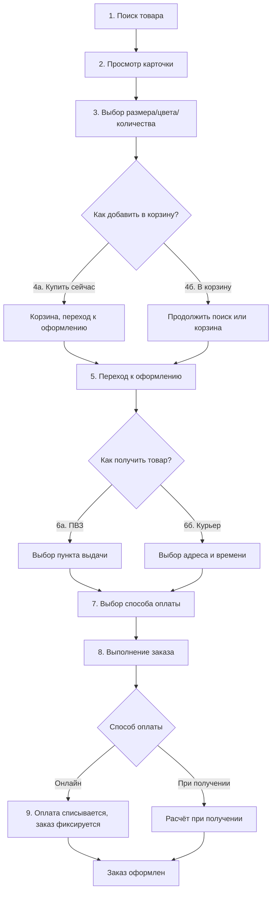
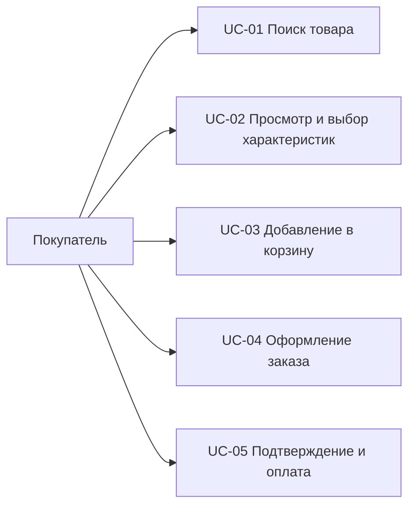

# Анализ пользовательского процесса "Покупка товара" в приложении Wildberries

## 1. Основные шаги процесса

Путь пользователя от поиска до создания заказа:

| № | Шаг | Описание |
|---|---|---|
| 1 | Поиск товара | Покупатель вводит запрос в поисковую строку, система показывает результаты ИЛИ открывает каталог и ищет по нему; при необходимости применяет фильтры |
| 2 | Просмотр карточки товара | Покупатель открывает карточку: фото, цена, описание, отзывы, характеристики |
| 3 | Выбор размера / цвета / количества | Покупатель выбирает характеристики товара и количество единиц |
| 4а | Добавление в корзину: Купить сейчас | Пользователь нажимает Купить сейчас; Система добавляет товар, переходит в корзину и проверяет состав заказа|
| 4б | Добавление в корзину: В корзину | Пользователь нажимает В корзину; Система добавляет товар, покупатель продолжает поиск товаров или переходит в корзину и проверяет состав заказа |
| 5 | Переход к оформлению заказа | Покупатель нажимает К оформлению |
| 6а | Выбор пункта выдачи | Покупатель выбирает ПВЗ для получения товара |
| 6б | Выбор доставки курьером | Покупатель выбирает адрес и время доставки |
| 7 | Выбор способа оплаты | Покупатель выбирает способ оплаты (онлайн / при получении; wb кошелек / карта / СБП; использование кешбека) |
| 8 | Выполнение заказа | Покупатель проверяет состав, сумму, способ доставки и оплаты, нажимает Заказать |
| 9 | Оплата (при онлайн-оплате) | Система списывает оплату и фиксирует заказ |

---

## 2. User Stories

Формат: *Как [роль], я хочу [действие], чтобы [ценность].*

### US-01. Поиск товара
> **Как покупатель, я хочу искать товар по ключевым словам и фильтрам, чтобы быстро найти нужный товар.**

**Критерии приёмки:**
- При вводе запроса система показывает результаты, релевантные запросу.
- По запросу без результатов система показывает сообщение "Не смогли найти "`текст_запроса`". Возможно вам понравится:" и список товаров которые могут подойти пользователю на основе его профиля\покупок\предыдущих поисков\избранного и отложенного.
- Фильтры (цена, бренд, категория и т.п.) применимы и сужают выдачу.

### US-02. Просмотр карточки товара
> **Как покупатель, я хочу видеть полную информацию о товаре (фото, цена, описание, отзывы, характеристики), чтобы принять решение о покупке.**

**Критерии приёмки:**
- Карточка содержит фото, актуальную цену, описание и характеристики.
- Отзывы покупателей доступны для просмотра.
- Если товара нет в наличии, это явно отображается или такой товар не попадает в выборку.

### US-03. Выбор характеристик и добавление в корзину
> **Как покупатель, я хочу выбрать размер, цвет и количество товара и добавить его в корзину, чтобы продолжить покупку.**

**Критерии приёмки:**
- Недоступные размеры/цвета отображаются как заблокированные.
- Количество ограничено доступным остатком.
- После добавления система показывает измененную иконку корзины и кнопку "в корзину" (показывает что товар добавлен).

### US-04. Оформление заказа
> **Как покупатель, я хочу выбрать пункт выдачи и способ оплаты, чтобы получить и оплатить товар удобным для меня способом.**

**Критерии приёмки:**
- Покупатель выбирает ПВЗ из списка доступных (поиск по адресу\на карте)
- Покупатель выбирает как оплатить заказ (онлайн или при получении)
- Покупатель выбирает способ оплаты (вб-кошелек/карта/сбп (может привязать\добавить если не привязано\добавлено))
- Может списать или не списывать кешбэк
- Может применить или не применять промокод
- Система показывает итоговую сумму с учётом скидок
- Пользователь выбирает согласия с условиями

### US-05. Подтверждение и оплата заказа
> **Как покупатель, я хочу подтвердить заказ и оплатить его, чтобы завершить покупку.**

**Критерии приёмки:**
- После подтверждения система присваивает заказу номер и показывает детали.
- При онлайн-оплате списание происходит только после успешного подтверждения.
- При ошибке оплаты деньги не списываются, заказ можно оплатить повторно.

---

## 3. Use Cases

### UC-01. Поиск товара

| Поле | Значение |
|---|---|
| ID | `UC-01` |
| Название | Поиск товара |
| Уровень | Цель пользователя |
| Краткое описание | Покупатель находит нужный товар через поиск по ключевым словам и фильтрам |
| Основной актор | Покупатель |
| Заинтересованные стороны | Покупатель хочет быстро найти товар; маркетплейс хочет показать релевантные и доступные к заказу товары; продавец хочет, чтобы его товар был найден |
| Предусловия | Приложение установлено, покупатель открыл главный экран |
| Минимальные гарантии | Система фиксирует поисковый запрос, результат поиска отображается |
| Гарантии успеха | Покупатель видит список товаров, соответствующих запросу, и открывает карточку нужного товара |
| Триггер | Покупатель вводит запрос в поисковую строку |
| Основной успешный сценарий | 1. Покупатель открывает приложение и поисковую строку. 2. Система отображает главный экран со строкой поиска. 3. Покупатель вводит поисковый запрос. 4. Система отображает результаты поиска с карточками товаров. 5. Покупатель выбирает нужный товар. 6. Система открывает карточку выбранного товара. |
| Расширения | `3a.` Запрос не дал результатов - система показывает "Ничего не найдено" и предлагает похожие запросы или исправление опечаток. `3b.` Покупатель применяет фильтры (цена, бренд) - система сужает результаты и обновляет выдачу. `4a.` Нет соединения с интернетом - система показывает сообщение об ошибке и предлагает повторить. |
| Специальные требования | Результаты поиска загружаются не дольше 3 секунд; поиск учитывает опечатки |
| Бизнес-правила | В результатах сначала показываются популярные товары |
| Частота использования | До 1 млн раз в день (основной вход в покупку) |
| Связанные use case / требования | `UC-02`, `US-01` |
| Открытые вопросы | - |

---

### UC-02. Просмотр карточки товара и выбор характеристик

| Поле | Значение |
|---|---|
| ID | `UC-02` |
| Название | Просмотр карточки товара и выбор характеристик |
| Уровень | Цель пользователя |
| Краткое описание | Покупатель изучает информацию о товаре и выбирает размер, цвет и количество |
| Основной актор | Покупатель |
| Заинтересованные стороны | Покупатель хочет принять решение о покупке; продавец хочет, чтобы информация о товаре была полной и точной |
| Предусловия | Покупатель открыл карточку товара (из поиска или каталога) |
| Минимальные гарантии | Система отображает актуальные характеристики и наличие товара |
| Гарантии успеха | Покупатель выбрал размер, цвет и количество; система показала актуальную цену |
| Триггер | Покупатель открывает карточку товара |
| Основной успешный сценарий | 1. Покупатель открывает карточку товара. 2. Система отображает фото, цену, описание, отзывы и доступные характеристики. 3. Покупатель выбирает размер и цвет. 4. Система отображает выбранные характеристики и актуальную цену. 5. Покупатель выбирает количество. 6. Система отображает выбранное количество. |
| Расширения | `3a.` Выбранного размера нет в наличии - система блокирует выбор и показывает статус "нет в наличии". `5a.` Покупатель указывает количество больше остатка - система ограничивает количество доступным остатком.|
| Специальные требования | Фото товара отображаются без искажения; цена и наличие обновляются в реальном времени |
| Бизнес-правила | Товар с обязательными характеристиками (например, размер) нельзя добавить в корзину без их выбора |
| Частота использования | До 1 млн раз в день |
| Связанные use case / требования | `UC-01`, `UC-03`, `US-02`, `US-03` |
| Открытые вопросы | - |

---

### UC-03. Добавление товара в корзину

| Поле | Значение |
|---|---|
| ID | `UC-03` |
| Название | Добавление товара в корзину |
| Уровень | Цель пользователя |
| Краткое описание | Покупатель добавляет товар с выбранными характеристиками в корзину и переходит к оформлению |
| Основной актор | Покупатель |
| Заинтересованные стороны | Покупатель хочет собрать товары и оформить заказ; маркетплейс хочет, чтобы добавление было простым и не теряло состав корзины |
| Предусловия | Покупатель на карточке товара выбрал характеристики |
| Минимальные гарантии | Действие добавления зафиксировано, корзина не теряет уже добавленные товары |
| Гарантии успеха | Товар добавлен в корзину, итоговая сумма пересчитана, покупатель перешёл к оформлению |
| Триггер | Покупатель нажимает кнопку "В корзину" |
| Основной успешный сценарий | 1. Покупатель нажимает кнопку "В корзину". 2. Система добавляет товар и отображает подтверждение. 3. Покупатель переходит в корзину. 4. Система отображает состав корзины и итоговую сумму. 5. Покупатель корректирует состав при необходимости. 6. Система пересчитывает итоговую сумму. 7. Покупатель нажимает "Перейти к оформлению". 8. Система открывает экран оформления заказа. |
| Расширения | `1a.` Характеристики не выбраны - система не добавляет товар и подсказывает выбрать размер/цвет. `5a.` Покупатель удаляет товар из корзины - система убирает товар и пересчитывает сумму. `7a.` Корзина пуста - система блокирует переход к оформлению. `4a.` Цена товара изменилась - система показывает актуальную цену и предупреждение. |
| Специальные требования | Пересчёт суммы корзины занимает не более 1 секунды |
| Бизнес-правила | Количество товара в корзине не может превышать доступный остаток |
| Частота использования | До 500 тыс. раз в день |
| Связанные use case / требования | `UC-02`, `UC-04`, `US-03` |
| Открытые вопросы | - |

---

### UC-04. Оформление заказа: выбор пункта выдачи и способа оплаты

| Поле | Значение |
|---|---|
| ID | `UC-04` |
| Название | Оформление заказа: выбор пункта выдачи и способа оплаты |
| Уровень | Цель пользователя |
| Краткое описание | Покупатель выбирает пункт выдачи и способ оплаты, проверяет состав и сумму заказа |
| Основной актор | Покупатель |
| Заинтересованные стороны | Покупатель хочет получить товар удобным способом; маркетплейс хочет корректно рассчитать доставку и провести оплату |
| Предусловия | Корзина не пуста, покупатель нажал "Перейти к оформлению" |
| Минимальные гарантии | Выбор ПВЗ и способа оплаты сохранён на экране оформления |
| Гарантии успеха | Система подтвердила ПВЗ и способ оплаты, показала итоговую сумму, доступен переход к подтверждению заказа |
| Триггер | Покупатель переходит к оформлению заказа |
| Основной успешный сценарий | 1. Покупатель переходит к оформлению заказа. 2. Система отображает шаги оформления: адрес доставки, оплата, состав заказа. 3. Покупатель выбирает пункт выдачи. 4. Система отображает выбранный ПВЗ и подтверждает его. 5. Покупатель выбирает способ оплаты. 6. Система сохраняет выбранный способ оплаты. 7. Покупатель проверяет состав заказа и итоговую сумму. 8. Система отображает итоговую стоимость с учётом скидок и доставки. |
| Расширения | `7a.` Состав заказа изменился - система пересчитывает сумму. `2a.` Отсутствует соединение - система показывает ошибку и блокирует оформление до восстановления связи. |
| Специальные требования | Список ПВЗ отображается с картой и режимом работы; итоговая сумма показывается до подтверждения |
| Бизнес-правила | Способ оплаты "при получении" доступен только при сумме заказа выше установленного порога |
| Частота использования | До 300 тыс. раз в день |
| Связанные use case / требования | `UC-03`, `UC-05`, `US-04` |
| Открытые вопросы | - |

---

### UC-05. Подтверждение и оплата заказа

| Поле | Значение |
|---|---|
| ID | `UC-05` |
| Название | Подтверждение и оплата заказа |
| Уровень | Цель пользователя |
| Краткое описание | Покупатель подтверждает заказ, оплачивает его (при онлайн-оплате) и получает номер заказа |
| Основной актор | Покупатель |
| Заинтересованные стороны | Покупатель хочет завершить покупку и быть уверенным, что заказ принят; маркетплейс хочет корректно провести оплату и зафиксировать заказ; продавец хочет получить заказ на сборку |
| Предусловия | Покупатель завершил оформление (выбрал ПВЗ и способ оплаты) |
| Минимальные гарантии | Попытка оформления зафиксирована; денежные средства не списываются без успешного подтверждения |
| Гарантии успеха | Заказ создан, ему присвоен номер, оплата проведена (при онлайн-оплате), покупатель видит подтверждение |
| Триггер | Покупатель нажимает кнопку "Оформить заказ" |
| Основной успешный сценарий | 1. Покупатель нажимает "Оформить заказ". 2. Система проверяет данные заказа. 3. Система создаёт заказ и присваивает ему номер. 4. Система отображает экран подтверждения с номером и деталями заказа. 5. Покупатель оплачивает заказ выбранным способом (при онлайн-оплате). 6. Система подтверждает оплату и фиксирует заказ. |
| Расширения | `2a.` Обязательные данные не заполнены - система показывает ошибку и возвращает к нужному шагу. `3a.` Сервис создания заказа недоступен - система показывает сообщение, заказ не создаётся, деньги не списываются. `5a.` Оплата не прошла (недостаточно средств, отказ банка) - система показывает ошибку, деньги не списываются, покупатель может повторить оплату. `5b.` Оплата при получении - система не списывает средства и сообщает о расчёте в пункте выдачи. |
| Специальные требования | Подтверждение заказа загружается не дольше 5 секунд; номер заказа доступен для повторного просмотра |
| Бизнес-правила | Заказ считается созданным только после успешного подтверждения системой; деньги списываются только после успешной оплаты |
| Частота использования | До 300 тыс. раз в день |
| Связанные use case / требования | `UC-04`, `US-05` |
| Открытые вопросы | - |

---

## 4. Таблица соответствия

| User Story | Use Case | Шаг процесса |
|---|---|---|
| `US-01` Поиск товара | `UC-01` Поиск товара | 1 |
| `US-02` Просмотр карточки | `UC-02` Просмотр и выбор характеристик | 2-3 |
| `US-03` Добавление в корзину | `UC-03` Добавление в корзину | 4 |
| `US-04` Оформление заказа | `UC-04` Выбор ПВЗ и оплаты | 5-7 |
| `US-05` Подтверждение и оплата | `UC-05` Подтверждение и оплата | 8-9 |
